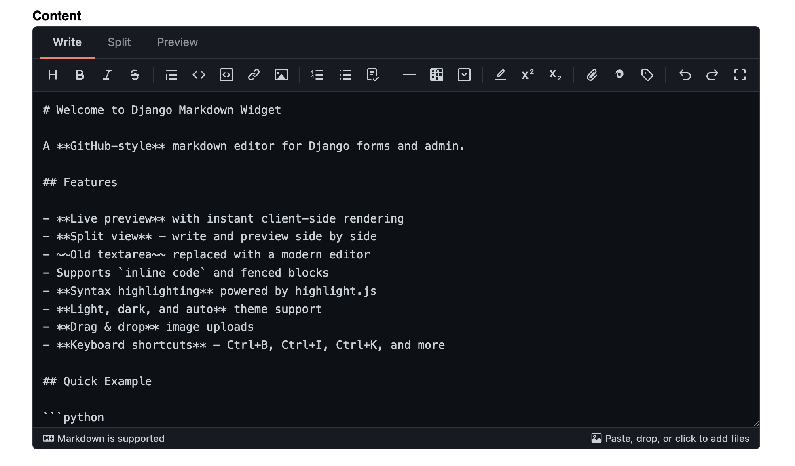
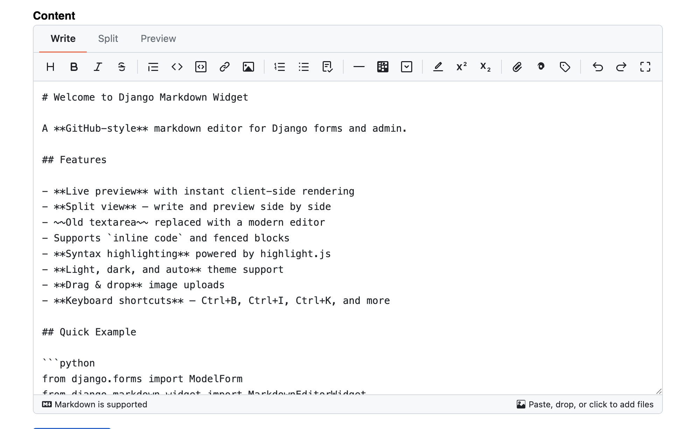
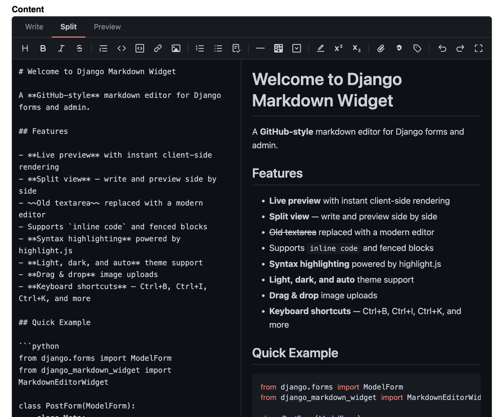
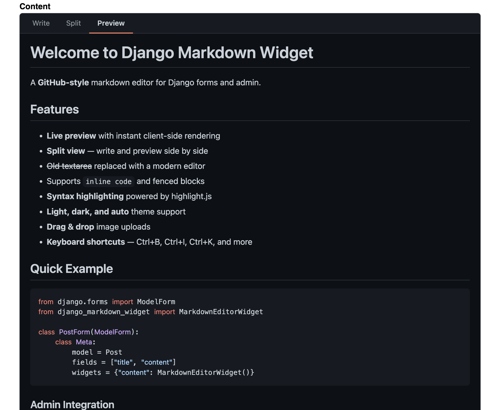

# django-markdown-widget

A GitHub-style markdown editor widget for Django forms and admin.

## Screenshots

| Dark (default) | Light |
|:-:|:-:|
|  |  |

| Split View | Preview |
|:-:|:-:|
|  |  |

## Why django-markdown-widget?

- **Drop-in widget** -- works with any Django form or ModelForm
- **Three view modes** -- write, split (side-by-side with live preview), and preview
- **Syntax highlighting** -- code blocks highlighted via highlight.js
- **Rich media** -- upload images, videos, documents; embed YouTube, Vimeo, CodePen
- **Autosave** -- drafts saved to localStorage, survives page reloads
- **Temp uploads** -- files go to temp storage first, finalize on form submit
- **One-line admin integration** -- mixin replaces TextFields with the editor
- **Pluggable architecture** -- swap renderers and upload handlers without changing code
- **Security** -- HTML sanitization on client and server, CSRF protection, path traversal prevention
- **No heavy dependencies** -- only Django is required; markdown library is optional
- **Themes** -- light, dark, and auto (follows system preference)

## Quick Example

```python
from django.forms import ModelForm
from django_markdown_widget import MarkdownEditorWidget

class PostForm(ModelForm):
    class Meta:
        model = Post
        fields = ["title", "content"]
        widgets = {
            "content": MarkdownEditorWidget(),
        }
```

That's it. The editor includes a toolbar, live preview, image uploads, and keyboard shortcuts out of the box.

## Next Steps

- [Installation](getting-started/installation.md) -- install the package and wire it up
- [Quick Start](getting-started/quickstart.md) -- form, admin, and template usage in 5 minutes
- [Configuration](guide/configuration.md) -- all available settings
